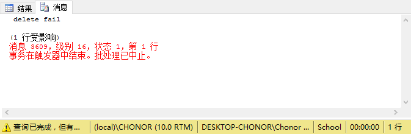

1.  ​

    ~~~mssql
    CREATE TABLE CARD (
    cid CHAR(10) not null UNIQUE, 
    sid CHAR(10) not null, 
    money decimal(10,2),
    PRIMARY KEY(cid),
    FOREIGN KEY(sid) REFERENCES STUDENTS ON DELETE CASCADE
    )
    SELECT * from card
    ~~~

    

2.  ​

    ~~~mssql
    ALTER TABLE CARD ADD bank CHAR(20)

    SELECT * from card
    ~~~

    ​

    

3.  ​

    ~~~mssql
    ALTER TABLE CARD DROP column bank
    SELECT * from card
    ~~~

    

4.  ​

    ~~~mssql
    select TEACHERS.tname,COURSES.cname
    from TEACHERS,COURSES,CHOICES
    WHERE TEACHERS.tid=CHOICES.tid AND CHOICES.cid=COURSES.cid 
    AND TEACHERS.salary>=ALL(
    SELECT salary
    FROM TEACHERS
    WHERE salary IS NOT NULL
    )
    ~~~

    

5.  ​

    ~~~mssql
    select cname
    from COURSES
    where hour=(select hour from COURSES where cname='uml') OR
    hour=(select hour from COURSES where cname='c++')
    ~~~

    

6.  ​

    ~~~mssql
    SELECT sid 
    FROM CHOICES
    WHERE cid IN(
    SELECT cid FROM COURSES WHERE COURSES.cname='c++'
    )
    EXCEPT
    SELECT sid
    FROM CHOICES
    WHERE cid IN(
    SELECT cid FROM COURSES WHERE COURSES.cname='database'
    )
    ~~~

    

7.  ​

    ~~~mssql
    SELECT DISTINCT STUDENTS.sid
    FROM CHOICES,STUDENTS,COURSES
    WHERE CHOICES.cid=COURSES.cid
    AND COURSES.cname='database'
    AND CHOICES.sid=STUDENTS.sid
    AND CHOICES.score>(
    SELECT CHOICES.score
    FROM CHOICES,STUDENTS,COURSES
    WHERE STUDENTS.sname='ruvldjlm'
    AND CHOICES.sid=STUDENTS.sid
    AND COURSES.cname='database'
    AND CHOICES.cid=COURSES.cid
    )
    ~~~

    

8.  ​

    ~~~mssql
    SELECT MAX(CHOICES.score) as maxs,AVG(CHOICES.score) as avgs
    From CHOICES,COURSES
    WHERE CHOICES.cid = COURSES.cid AND COURSES.cname='database'
    ~~~

    

9.  ​

    ~~~mssql
    SELECT STUDENTS.sname 
    FROM CHOICES,STUDENTS,COURSES
    WHERE CHOICES.sid=STUDENTS.sid
    AND CHOICES.cid=COURSES.cid
    AND COURSES.cname='database'
    AND CHOICES.score>=ALL(
    SELECT CHOICES.score
    FROM CHOICES,COURSES
    WHERE COURSES.cname='database'
    AND CHOICES.cid=COURSES.cid
    AND CHOICES.score IS NOT NULL
    )
    ~~~

    

10.  ​

    ~~~mssql
    SELECT sname 
    FROM STUDENTS
    WHERE sname NOT IN(
    SELECT STUDENTS.sname
    FROM COURSES,STUDENTS,CHOICES
    WHERE COURSES.cname='database'
    AND CHOICES.cid=COURSES.cid
    AND STUDENTS.sid=CHOICES.sid
    )
    ~~~

    

11.  ​

     ~~~mssql
     SELECT STUDENTS.sname 
     FROM CHOICES,STUDENTS
     WHERE CHOICES.sid = STUDENTS.sid
     GROUP BY CHOICES.sid ,STUDENTS.sname
     HAVING COUNT(CHOICES.sid)>2
     ORDER BY CHOICES.sid
     ~~~

     

12.  ​

     ~~~mssql
     CREATE VIEW VIEW_SC(sname,cname,score)
     AS SELECT
     STUDENTS.sname,COURSES.cname,CHOICES.score
     FROM CHOICES,COURSES,STUDENTS
     WHERE CHOICES.cid = COURSES.cid AND CHOICES.sid= STUDENTS.sid

     SELECT * FROM VIEW_SC
     ~~~

     

13.  ​

     ~~~mssql
     SELECT sname 
     FROM VIEW_SC
     WHERE score>90
     ~~~

     

14.  ​

     ~~~mssql
     insert into VIEW_SC values ('test','test','99')
     ~~~

     

     此时插入全新的数据会影响到多个表比如 STUDENTS,COURSES,CHOICES，因为他们的主键都不能为null，而我们没有插入主键，所以不能插入。

15.  ​

     ~~~mssql
     GO
     CREATE RULE R1 AS @money >0
     GO
     EXEC sp_bindrule R1,'CARD.[money]'
     ~~~

     

16.  ​

     ~~~mssql
     insert into CARD values ('1000','807171972','-0.1')
     ~~~

     

17.  ​

     ~~~mssql
     EXEC sp_unbindrule 'CARD.[money]'
     ~~~

     

     ~~~mssql
     insert into CARD values ('1000','807171972','-0.1')
     Select * from CARD
     ~~~

     

18.  ​

     ~~~mssql
     go
     create trigger T1 on STUDENTS
     for delete
     as
     if (select sid from deleted)='800015960'
     begin
     print ' delete fail '
     Rollback transaction
     end
     ~~~

     

19.  ​

     ~~~mssql
     delete from choices where sid='800015960'
     delete from STUDENTS where sid='800015960'
     ~~~

     

20.  ​

     ~~~mssql
     SELECT * from STUDENTS where sid='800015960'
     SELECT * from COURSES ORDER by cid
     ~~~

     

     ~~~mssql
     SET XACT_ABORT ON
     BEGIN TRAN up_stu
     UPDATE STUDENTS
     SET grade='1992'
     WHERE sid='800015960'
     BEGIN TRAN insert_cou
     INSERT INTO COURSES
     VALUES('10001','test','99')
     COMMIT TRAN insert_cou
     COMMIT TRAN up_stu
     ~~~

     

     再次查询

     

     此时我们发现没有插入回滚了。

